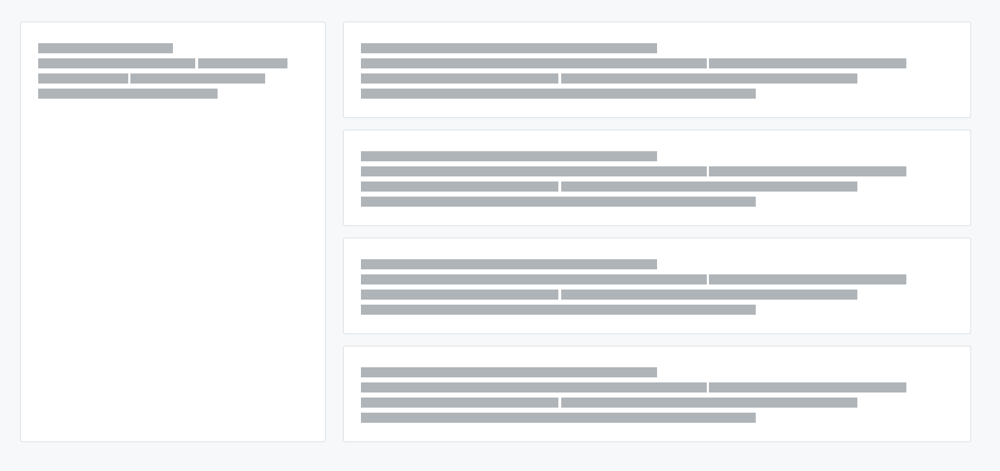
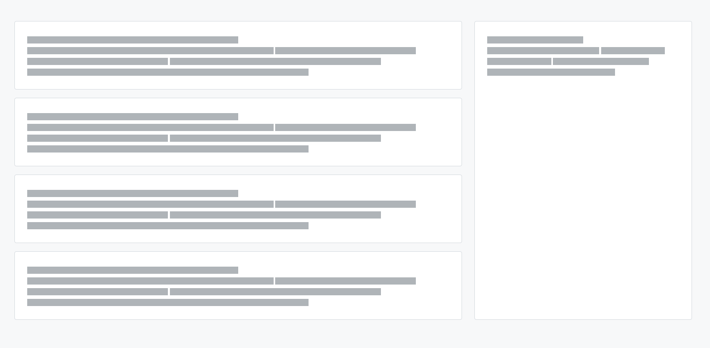

## Basic 1 boxe


```html
    <div class="layo-1box-arnelio mb-4">
    <div class="row gy-4">
        <div class="col layo-arnelio_section">
            <div style="width:100%" class="card text-bg-default border rounded h-100">

                <div class="card-header layo-arnelio_section__header px-4 py-3 d-flex align-items-center justify-content-between w-100">
                    <h3><span class="placeholder bg-secondary col-6"></span></h3>
                </div>
                 <div class="card-body layo-arnelio_section__body px-4 py-3">
                    <span class="placeholder bg-secondary col-6"></span>
                    <span class="placeholder bg-secondary col-7"></span>
                    <span class="placeholder bg-secondary col-4"></span>
                    <span class="placeholder bg-secondary col-4"></span>
                    <span class="placeholder bg-secondary col-6"></span>
                    <span class="placeholder bg-secondary col-8"></span>
                </div>
                
            </div>
        </div>
    </div>
</div>
```

---


## Basic 2 boxes


```html
<div class="layo-2box-arnelio mb-4">
    <div class="row gy-4">
        <div class="col-lg-6 layo-arnelio_section">
            <div style="width:100%" class="card text-bg-default border rounded h-100">

                <div class="card-header layo-arnelio_section__header px-4 py-3 d-flex align-items-center justify-content-between w-100">
                    <h3><span class="placeholder bg-secondary col-6"></span></h3>
                </div>
                 <div class="card-body layo-arnelio_section__body px-4 py-3">
                    <span class="placeholder bg-secondary col-6"></span>
                    <span class="placeholder bg-secondary col-7"></span>
                    <span class="placeholder bg-secondary col-4"></span>
                    <span class="placeholder bg-secondary col-4"></span>
                    <span class="placeholder bg-secondary col-6"></span>
                    <span class="placeholder bg-secondary col-8"></span>
                </div>

            </div>
        </div>
        <div class="col-lg-6 layo-arnelio_section">
            <div style="width:100%" class="card text-bg-default border rounded h-100">

                <div class="card-header layo-arnelio_section__header px-4 py-3 d-flex align-items-center justify-content-between w-100">
                    <h3><span class="placeholder bg-secondary col-6"></span></h3>
                </div>
                 <div class="card-body layo-arnelio_section__body px-4 py-3">
                    <span class="placeholder bg-secondary col-6"></span>
                    <span class="placeholder bg-secondary col-7"></span>
                    <span class="placeholder bg-secondary col-4"></span>
                    <span class="placeholder bg-secondary col-4"></span>
                    <span class="placeholder bg-secondary col-6"></span>
                    <span class="placeholder bg-secondary col-8"></span>
                </div>

            </div>
        </div>
    </div>
</div>
```

---


## Basic 3 boxes


```html
<div class="layo-3box-arnelio mb-4">
    <div class="row gy-4">
        <div class="col-md-4 layo-arnelio_section">
            <div style="width:100%" class="card text-bg-default border rounded h-100">

                <div class="card-header layo-arnelio_section__header px-4 py-3 d-flex align-items-center justify-content-between w-100">
                    <h3><span class="placeholder bg-secondary col-6"></span></h3>
                </div>
                 <div class="card-body layo-arnelio_section__body px-4 py-3">
                    <span class="placeholder bg-secondary col-6"></span>
                    <span class="placeholder bg-secondary col-7"></span>
                    <span class="placeholder bg-secondary col-4"></span>
                    <span class="placeholder bg-secondary col-4"></span>
                    <span class="placeholder bg-secondary col-6"></span>
                    <span class="placeholder bg-secondary col-8"></span>
                </div>

            </div>
        </div>
        <div class="col-md-4 layo-arnelio_section">
            <div style="width:100%" class="card text-bg-default border rounded h-100">

                <div class="card-header layo-arnelio_section__header px-4 py-3 d-flex align-items-center justify-content-between w-100">
                    <h3><span class="placeholder bg-secondary col-6"></span></h3>
                </div>
                 <div class="card-body layo-arnelio_section__body px-4 py-3">
                    <span class="placeholder bg-secondary col-6"></span>
                    <span class="placeholder bg-secondary col-7"></span>
                    <span class="placeholder bg-secondary col-4"></span>
                    <span class="placeholder bg-secondary col-4"></span>
                    <span class="placeholder bg-secondary col-6"></span>
                    <span class="placeholder bg-secondary col-8"></span>
                </div>

            </div>
        </div>
        <div class="col-md-4 layo-arnelio_section">
            <div style="width:100%" class="card text-bg-default border rounded h-100">

                <div class="card-header layo-arnelio_section__header px-4 py-3 d-flex align-items-center justify-content-between w-100">
                    <h3><span class="placeholder bg-secondary col-6"></span></h3>
                </div>
                 <div class="card-body layo-arnelio_section__body px-4 py-3">
                    <span class="placeholder bg-secondary col-6"></span>
                    <span class="placeholder bg-secondary col-7"></span>
                    <span class="placeholder bg-secondary col-4"></span>
                    <span class="placeholder bg-secondary col-4"></span>
                    <span class="placeholder bg-secondary col-6"></span>
                    <span class="placeholder bg-secondary col-8"></span>
                </div>

            </div>
        </div>
    </div>
</div>
```

---


## Basic 4 boxes


```html
<div class="layo-4box-arnelio mb-4">
    <div class="row row-cols-sm-1 row-cols-md-2 row-cols-lg-4 gy-4">
        <div class="layo-arnelio_section">
            <div style="width:100%" class="card text-bg-default border rounded h-100">

                <div class="card-header layo-arnelio_section__header px-4 py-3 d-flex align-items-center justify-content-between w-100">
                    <h3><span class="placeholder bg-secondary col-6"></span></h3>
                </div>
                 <div class="card-body layo-arnelio_section__body px-4 py-3">
                    <span class="placeholder bg-secondary col-6"></span>
                    <span class="placeholder bg-secondary col-7"></span>
                    <span class="placeholder bg-secondary col-4"></span>
                    <span class="placeholder bg-secondary col-4"></span>
                    <span class="placeholder bg-secondary col-6"></span>
                    <span class="placeholder bg-secondary col-8"></span>
                </div>

            </div>
        </div>
        <div class="layo-arnelio_section">
            <div style="width:100%" class="card text-bg-default border rounded h-100">

                <div class="card-header layo-arnelio_section__header px-4 py-3 d-flex align-items-center justify-content-between w-100">
                    <h3><span class="placeholder bg-secondary col-6"></span></h3>
                </div>
                 <div class="card-body layo-arnelio_section__body px-4 py-3">
                    <span class="placeholder bg-secondary col-6"></span>
                    <span class="placeholder bg-secondary col-7"></span>
                    <span class="placeholder bg-secondary col-4"></span>
                    <span class="placeholder bg-secondary col-4"></span>
                    <span class="placeholder bg-secondary col-6"></span>
                    <span class="placeholder bg-secondary col-8"></span>
                </div>

            </div>
        </div>
        <div class="layo-arnelio_section">
            <div style="width:100%" class="card text-bg-default border rounded h-100">

                <div class="card-header layo-arnelio_section__header px-4 py-3 d-flex align-items-center justify-content-between w-100">
                    <h3><span class="placeholder bg-secondary col-6"></span></h3>
                </div>
                 <div class="card-body layo-arnelio_section__body px-4 py-3">
                    <span class="placeholder bg-secondary col-6"></span>
                    <span class="placeholder bg-secondary col-7"></span>
                    <span class="placeholder bg-secondary col-4"></span>
                    <span class="placeholder bg-secondary col-4"></span>
                    <span class="placeholder bg-secondary col-6"></span>
                    <span class="placeholder bg-secondary col-8"></span>
                </div>
                
            </div>
        </div>
        <div class="layo-arnelio_section">
            <div style="width:100%" class="card text-bg-default border rounded h-100">

                <div class="card-header layo-arnelio_section__header px-4 py-3 d-flex align-items-center justify-content-between w-100">
                    <h3><span class="placeholder bg-secondary col-6"></span></h3>
                </div>
                 <div class="card-body layo-arnelio_section__body px-4 py-3">
                    <span class="placeholder bg-secondary col-6"></span>
                    <span class="placeholder bg-secondary col-7"></span>
                    <span class="placeholder bg-secondary col-4"></span>
                    <span class="placeholder bg-secondary col-4"></span>
                    <span class="placeholder bg-secondary col-6"></span>
                    <span class="placeholder bg-secondary col-8"></span>
                </div>
                
            </div>
        </div>
    </div>
</div>
```


---


## Sidebar Left


```html
<div class="layo-2box-arnelio mb-4">
    <div class="row gy-4">
        <div class="col-md-4 layo-arnelio_section">
            <!-- Sidebar -->
            <div class="card text-bg-default border rounded h-100">
                <!-- Contenido del sidebar -->

                <div class="card-header layo-arnelio_section__header px-4 py-3 d-flex align-items-center justify-content-between w-100">
                    <h3><span class="placeholder bg-secondary col-6"></span></h3>
                </div>
                 <div class="card-body layo-arnelio_section__body px-4 py-3">
                    <span class="placeholder bg-secondary col-6"></span>
                    <span class="placeholder bg-secondary col-7"></span>
                    <span class="placeholder bg-secondary col-4"></span>
                    <span class="placeholder bg-secondary col-4"></span>
                    <span class="placeholder bg-secondary col-6"></span>
                    <span class="placeholder bg-secondary col-8"></span>
                </div>

            </div>
        </div>
        <div class="col-md-8 layo-arnelio_section">
            <!-- Área de contenido -->
            <div class="row h-100">
                <div class="col-12 mb-4">
                    <!-- Fila 1 del contenido -->
                    <div class="card text-bg-default border rounded h-100">

                        <div class="card-header layo-arnelio_section__header px-4 py-3 d-flex align-items-center justify-content-between w-100">
                            <h3><span class="placeholder bg-secondary col-6"></span></h3>
                        </div>
                        <div class="card-body layo-arnelio_section__body px-4 py-3">
                            <span class="placeholder bg-secondary col-6"></span>
                            <span class="placeholder bg-secondary col-7"></span>
                            <span class="placeholder bg-secondary col-4"></span>
                            <span class="placeholder bg-secondary col-4"></span>
                            <span class="placeholder bg-secondary col-6"></span>
                            <span class="placeholder bg-secondary col-8"></span>
                        </div>

                    </div>
                </div>
                <div class="col-12 mb-4">
                    <!-- Fila 2 del contenido -->
                    <div class="card text-bg-default border rounded h-100">

                        <div class="card-header layo-arnelio_section__header px-4 py-3 d-flex align-items-center justify-content-between w-100">
                            <h3><span class="placeholder bg-secondary col-6"></span></h3>
                        </div>
                        <div class="card-body layo-arnelio_section__body px-4 py-3">
                            <span class="placeholder bg-secondary col-6"></span>
                            <span class="placeholder bg-secondary col-7"></span>
                            <span class="placeholder bg-secondary col-4"></span>
                            <span class="placeholder bg-secondary col-4"></span>
                            <span class="placeholder bg-secondary col-6"></span>
                            <span class="placeholder bg-secondary col-8"></span>
                        </div>

                    </div>
                </div>
                <div class="col-12 mb-4">
                    <!-- Fila 3 del contenido -->
                    <div class="card text-bg-default border rounded h-100">

                        <div class="card-header layo-arnelio_section__header px-4 py-3 d-flex align-items-center justify-content-between w-100">
                            <h3><span class="placeholder bg-secondary col-6"></span></h3>
                        </div>
                        <div class="card-body layo-arnelio_section__body px-4 py-3">
                            <span class="placeholder bg-secondary col-6"></span>
                            <span class="placeholder bg-secondary col-7"></span>
                            <span class="placeholder bg-secondary col-4"></span>
                            <span class="placeholder bg-secondary col-4"></span>
                            <span class="placeholder bg-secondary col-6"></span>
                            <span class="placeholder bg-secondary col-8"></span>
                        </div>
                        
                    </div>
                </div>
                <div class="col-12">
                    <!-- Fila 4 del contenido -->
                    <div class="card text-bg-default border rounded h-100">

                        <div class="card-header layo-arnelio_section__header px-4 py-3 d-flex align-items-center justify-content-between w-100">
                            <h3><span class="placeholder bg-secondary col-6"></span></h3>
                        </div>
                        <div class="card-body layo-arnelio_section__body px-4 py-3">
                            <span class="placeholder bg-secondary col-6"></span>
                            <span class="placeholder bg-secondary col-7"></span>
                            <span class="placeholder bg-secondary col-4"></span>
                            <span class="placeholder bg-secondary col-4"></span>
                            <span class="placeholder bg-secondary col-6"></span>
                            <span class="placeholder bg-secondary col-8"></span>
                        </div>

                    </div>
                </div>
            </div>
        </div>
    </div>
</div>
```


---


## Sidebar Right


```html
<div class="layo-2box-arnelio mb-4">
    <div class="row gy-4">
        <div class="col-md-8 layo-arnelio_section">
            <!-- Área de contenido -->
            <div class="row h-100">
                <div class="col-12 mb-4">
                    <!-- Fila 1 del contenido -->
                    <div class="card text-bg-default border rounded h-100">

                        <div class="card-header layo-arnelio_section__header px-4 py-3 d-flex align-items-center justify-content-between w-100">
                            <h3><span class="placeholder bg-secondary col-6"></span></h3>
                        </div>
                        <div class="card-body layo-arnelio_section__body px-4 py-3">
                            <span class="placeholder bg-secondary col-6"></span>
                            <span class="placeholder bg-secondary col-7"></span>
                            <span class="placeholder bg-secondary col-4"></span>
                            <span class="placeholder bg-secondary col-4"></span>
                            <span class="placeholder bg-secondary col-6"></span>
                            <span class="placeholder bg-secondary col-8"></span>
                        </div>

                    </div>
                </div>
                <div class="col-12 mb-4">
                    <!-- Fila 2 del contenido -->
                    <div class="card text-bg-default border rounded h-100">

                        <div class="card-header layo-arnelio_section__header px-4 py-3 d-flex align-items-center justify-content-between w-100">
                            <h3><span class="placeholder bg-secondary col-6"></span></h3>
                        </div>
                        <div class="card-body layo-arnelio_section__body px-4 py-3">
                            <span class="placeholder bg-secondary col-6"></span>
                            <span class="placeholder bg-secondary col-7"></span>
                            <span class="placeholder bg-secondary col-4"></span>
                            <span class="placeholder bg-secondary col-4"></span>
                            <span class="placeholder bg-secondary col-6"></span>
                            <span class="placeholder bg-secondary col-8"></span>
                        </div>

                    </div>
                </div>
                <div class="col-12 mb-4">
                    <!-- Fila 3 del contenido -->
                    <div class="card text-bg-default border rounded h-100">

                        <div class="card-header layo-arnelio_section__header px-4 py-3 d-flex align-items-center justify-content-between w-100">
                            <h3><span class="placeholder bg-secondary col-6"></span></h3>
                        </div>
                        <div class="card-body layo-arnelio_section__body px-4 py-3">
                            <span class="placeholder bg-secondary col-6"></span>
                            <span class="placeholder bg-secondary col-7"></span>
                            <span class="placeholder bg-secondary col-4"></span>
                            <span class="placeholder bg-secondary col-4"></span>
                            <span class="placeholder bg-secondary col-6"></span>
                            <span class="placeholder bg-secondary col-8"></span>
                        </div>

                    </div>
                </div>
                <div class="col-12">
                    <!-- Fila 4 del contenido -->
                    <div class="card text-bg-default border rounded h-100">

                        <div class="card-header layo-arnelio_section__header px-4 py-3 d-flex align-items-center justify-content-between w-100">
                            <h3><span class="placeholder bg-secondary col-6"></span></h3>
                        </div>
                        <div class="card-body layo-arnelio_section__body px-4 py-3">
                            <span class="placeholder bg-secondary col-6"></span>
                            <span class="placeholder bg-secondary col-7"></span>
                            <span class="placeholder bg-secondary col-4"></span>
                            <span class="placeholder bg-secondary col-4"></span>
                            <span class="placeholder bg-secondary col-6"></span>
                            <span class="placeholder bg-secondary col-8"></span>
                        </div>

                    </div>
                </div>
            </div>
        </div>
        <div class="col-md-4 layo-arnelio_section">
            <!-- Sidebar -->
            <div class="card text-bg-default border rounded h-100 h-100">
                <!-- Contenido del sidebar -->

                <div class="card-header layo-arnelio_section__header px-4 py-3 d-flex align-items-center justify-content-between w-100">
                    <h3><span class="placeholder bg-secondary col-6"></span></h3>
                </div>
                <div class="card-body layo-arnelio_section__body px-4 py-3">
                    <span class="placeholder bg-secondary col-6"></span>
                    <span class="placeholder bg-secondary col-7"></span>
                    <span class="placeholder bg-secondary col-4"></span>
                    <span class="placeholder bg-secondary col-4"></span>
                    <span class="placeholder bg-secondary col-6"></span>
                    <span class="placeholder bg-secondary col-8"></span>
                </div>

            </div>
        </div>
    </div>
</div>
```


# Items

#### Badge Light
Para el header de los boxes. se posicionará a la derecha tipo float right pero con flexbox.

```html
<div class="badge-light">6.7.1</div>
```


### Clases CSS para el elemento layo-field

Son las clases padre que cambian el color de fondo de todo el box
```css
text-bg-default
text-bg-primary
text-bg-secondary
```