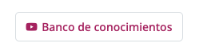

### Icon Link 1


```html
<a class="icon-link icon-link-hover" href="#">Icon link <i class="bi bi-arrow-right"></i></a>
```

### Icon Link 2


```html
<a class="icon-link icon-link-hover" style="--bs-icon-link-transform: translate3d(0, -.125rem, 0);" href="#"><i class="bi bi-clipboard"></i>Icon link</a>
```

---

### Link hover suave


```html
<a href="#" class="btn btn-hover-arnelio">Ahora no</a>
```

### botón box 


```html
 <a href="#" class="btn btn-box-arnelio"><i class="bi bi-youtube"></i> Banco de conocimientos</a>
```