### Texto


```php
<?php
    // Text
$arg = [
    'title'      => __('Text', 'arnelioconnect'),
    'name_option' => $name_option,
    'name'       => '',
    'initial'    => $initial,
    'values'     => $values,
    'docu'       => null,
    'info'       => __('This is the description of the user information field.','arnelioconnect'),
    'css'        => ' mb-3',
    'blo'        => null,
    'required'   => null,
    'placeholder' => '...',
];
scfs_arnelioconnect_text_field( $arg )
?>
```


---


### Textarea
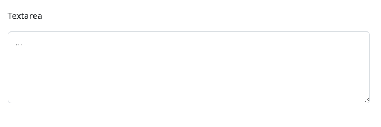

```php
<?php
    // Textarea
$arg = [
    'title'      => __('Textarea', 'arnelioconnect'),
    'name_option' => $name_option,
    'name'       => ''.'_textarea',
    'initial'    => $initial,
    'values'     => $values,
    'docu'       => null,
    'info'       => __('This is the description of the user information field.','arnelioconnect'),
    'css'        => ' mb-3',
    'blo'        => null,
    'required'   => null,
    'placeholder' => '...',
    'rows'       => 5,
];
scfs_arnelioconnect_textarea_field( $arg )
?>
```


---


### Custom CSS
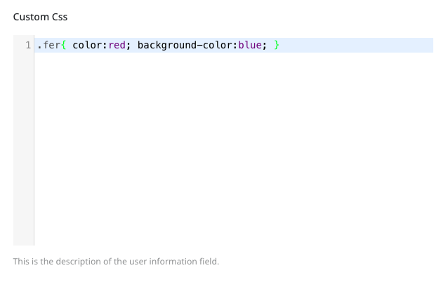

```php
<?php
    // Custom CSS
$arg = [
    'title'      => __('Custom CSS', 'arnelioconnect'),
    'name_option' => $name_option,
    'name'       => ''.'_textarea',
    'initial'    => $initial,
    'values'     => $values,
    'docu'       => null,
    'info'       => __('This is the description of the user information field.','arnelioconnect'),
    'css'        => ' mb-3',
    'blo'        => null
];
scfs_arnelioconnect_custom_css_field( $arg )
?>
```


---


### Wp Editor
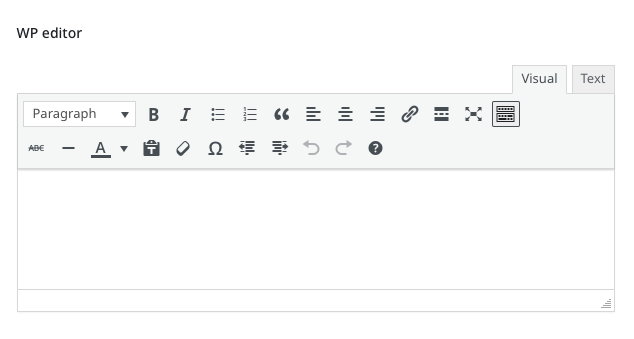

```php
<?php
    // Wp Editor
$arg = [
    'title'      => __('Wp Editor', 'arnelioconnect'),
    'name_option' => $name_option,
    'name'       => ''.'_wp_editor',
    'initial'    => $initial,
    'values'     => $values,
    'docu'       => null,
    'info'       => __('This is the description of the user information field.','arnelioconnect'),
    'css'        => ' mb-3',
    'blo'        => null,
    'required'   => null,
    'placeholder' => '...',
    'rows'       => 5,
];
scfs_arnelioconnect_wp_editor_field( $arg )
?>
```


---


### Radio classic inline
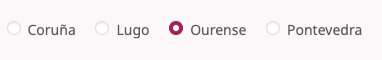

```php
<?php
    // Radio inline
$arg = [
    'title'      => __('Radio inline', 'arnelioconnect'),
    'name_option' => $name_option,
    'name'       => '',
    'initial'    => $initial,
    'values'     => $values,
    'docu'       => null,
    'info'       => __('This is the description of the user information field.','arnelioconnect'),
    'css'        => ' mb-3',
    'blo'        => null,
];
scfs_arnelioconnect_radio_inline_field( $arg )
?>
```
---

### Radio buttons simple inline


```php
<?php
    // Radio buttons inline
$arg = [
    'title'      => __('Radio buttons inline', 'arnelioconnect'),
    'name_option' => $name_option,
    'name'       => '',
    'initial'    => $initial,
    'values'     => $values,
    'docu'       => null,
    'info'       => __('This is the description of the user information field.','arnelioconnect'),
    'css'        => ' mb-3',
    'blo'        => null,
];
scfs_arnelioconnect_button_inline_field( $arg )
?>
```

---


### Checkbox buttons multiple
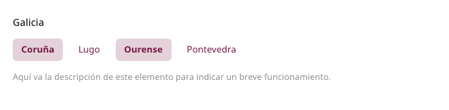

```php
<?php
    // Checkbox buttons multiple
$arg = [
    'title'      => __('Checkbox buttons multiple', 'arnelioconnect'),
    'name_option' => $name_option,
    'name'       => '',
    'initial'    => $initial,
    'values'     => $values,
    'docu'       => null,
    'info'       => __('This is the description of the user information field.','arnelioconnect'),
    'css'        => ' mb-3',
    'blo'        => null,
];
scfs_arnelioconnect_button_inline_m_field( $arg )
?>
```

---


### Checkbox classic


```php
<?php
    // Checkbox
$arg = [
    'title'      => __('Checkbox', 'arnelioconnect'),
    'name_option' => $name_option,
    'name'       => '',
    'initial'    => $initial,
    'values'     => $values,
    'docu'       => null,
    'info'       => __('This is the description of the user information field.','arnelioconnect'),
    'css'        => ' mb-3',
    'blo'        => null,
];
scfs_arnelioconnect_checkbox_field( $arg )
?>
```


---


### Checkbox multiple


```php
<?php
    // Checkbox multiple
$arg = [
    'title'      => __('Checkbox multiple', 'arnelioconnect'),
    'name_option' => $name_option,
    'name'       => '',
    'initial'    => $initial,
    'values'     => $values,
    'docu'       => null,
    'info'       => __('This is the description of the user information field.','arnelioconnect'),
    'css'        => ' mb-3',
    'blo'        => null,
];
scfs_arnelioconnect_checkbox_m_field( $arg )
?>
```


---


### Select


```php
<?php
    // Select
$arg = [
    'title'      => __('Select', 'arnelioconnect'),
    'name_option' => $name_option,
    'name'       => '',
    'initial'    => $initial,
    'values'     => $values,
    'docu'       => null,
    'info'       => __('This is the description of the user information field.','arnelioconnect'),
    'css'        => ' mb-3',
    'blo'        => null,
];
scfs_arnelioconnect_select_field( $arg )
?>
```


---


### Select multiple
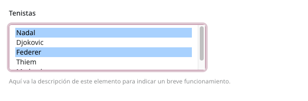

```php
<?php
    // Select multiple
$arg = [
    'title'      => __('Select multiple', 'arnelioconnect'),
    'name_option' => $name_option,
    'name'       => '',
    'initial'    => $initial,
    'values'     => $values,
    'docu'       => null,
    'info'       => __('This is the description of the user information field.','arnelioconnect'),
    'css'        => ' mb-3',
    'blo'        => null,
];
scfs_arnelioconnect_select_m_field( $arg )
?>
```


---


### Switch
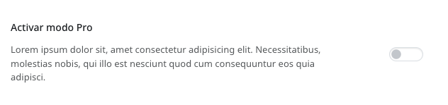

```php
<?php
    // Switch
$arg = [
    'title'      => __('Switch', 'arnelioconnect'),
    'name_option' => $name_option,
    'name'       => '',
    'initial'    => $initial,
    'values'     => $values,
    'docu'       => null,
    'info'       => __('This is the description of the user information field.','arnelioconnect'),
    'css'        => ' mb-3',
    'blo'        => null,
];
scfs_arnelioconnect_switch_field( $arg )
?>
```


---


### Button toggle


```php
<?php
// Button toggle
$arg = [
    'title'       => __('', 'arnelioconnect'),
    'title2'  => __('', 'arnelioconnect'),
    'name_option' => $name_option,
    'name'        => '',
    'initial'     => $initial,
    'values'      => $values,
    'css'         => '',
    'blo'         => null,
];
scfs_arnelioconnect_button_toggle_field( $arg);
?>
```


---


### Number
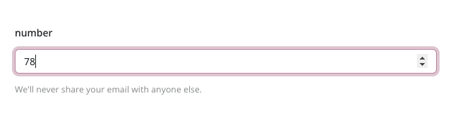

```php
<?php
    // Number
$arg = [
    'title'      => __('Number', 'arnelioconnect'),
    'name_option' => $name_option,
    'name'       => '',
    'initial'    => $initial,
    'values'     => $values,
    'docu'       => null,
    'info'       => __('This is the description of the user information field.','arnelioconnect'),
    'css'        => ' mb-3',
    'blo'        => null,
    'required'   => null,
    'placeholder' => '...',
];
scfs_arnelioconnect_number_field( $arg )
?>
```


---


### Color
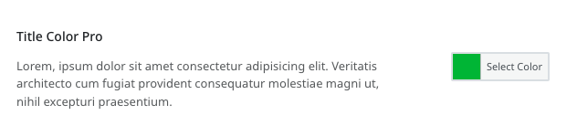

```php
<?php
    // Color
$arg = [
    'title'      => __('Color', 'arnelioconnect'),
    'name_option' => $name_option,
    'name'       => '',
    'initial'    => $initial,
    'values'     => $values,
    'docu'       => null,
    'info'       => __('This is the description of the user information field.','arnelioconnect'),
    'css'        => ' mb-3',
    'blo'        => null,
];
Scfs_arnelioconnect_color_picker_class::scfs_arnelioconnect_color_field( $arg )
?>
```


---


### Range
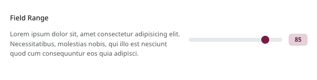

```php
<?php
    // Range
$arg = [
    'title'      => __('Range', 'arnelioconnect'),
    'name_option' => $name_option,
    'name'       => '',
    'initial'    => $initial,
    'values'     => $values,
    'min'        => 0,
    'max'        => 100,
    'step'       => 1,
    'docu'       => null,
    'info'       => __('This is the description of the user information field.','arnelioconnect'),
    'css'        => ' mb-3',
    'blo'        => null,
];
scfs_arnelioconnect_range_field( $arg )
?>
```


---


### Date transient admin
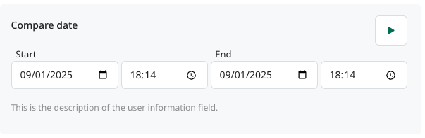

```php
    ''   => [
        'check'      => 1,
        'start'      => '',
        'end'        => '',
        'start_date' => '',
        'start_time' => '',
        'end_date'   => '',
        'end_time'   => '',
    ],
```
 
```php
<?php
// Date Transient Admin
$arg = [
    'title'      => __('Date transient admin', 'arnelioconnect'),
    'name_option' => $name_option,
    'name'       => '',
    'initial'    => $initial,
    'values'     => $values,
    'docu'       => null,
    'info'       => __('This is the description of the user information field.','arnelioconnect'),
    'css'        => ' mb-3',
    'blo'        => null,
];
Scfs_arnelioconnect_date_transient_admin_class::Scfs_arnelioconnect_date_transient_admin_field( $arg)
?>
```


---


### Compare time field


```php
    ''   => [
        'start'      => '',
        'end'        => '',
        'start_date' => '',
        'start_time' => '',
        'end_date'   => '',
        'end_time'   => '',
    ],
```
 
```php
<?php
// Compare time field
$arg = [
    'title'      => __('Compare time field', 'arnelioconnect'),
    'name_option' => $name_option,
    'name'       => '',
    'initial'    => $initial,
    'values'     => $values,
    'docu'       => null,
    'info'       => __('This is the description of the user information field.','arnelioconnect'),
    'css'        => ' mb-3',
    'blo'        => null,
];
Scfs_arnelioconnect_compare_time_field_class::Scfs_arnelioconnect_compare_time_field( $arg);
?>
```


---


### Image
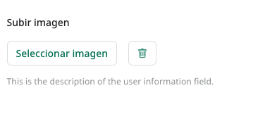

```php
<?php
    // Image upload
$arg = [
    'title'      => __('Image upload', 'arnelioconnect'),
    'name_option' => $name_option,
    'name'       => '',
    'initial'    => $initial,
    'values'     => $values,
    'docu'       => null,
    'info'       => __('This is the description of the user information field.','arnelioconnect'),
    'css'        => ' mb-3',
    'blo'        => null,
];
Scfs_arnelioconnect_image_wordpress_field( $arg )
?>
```


---


### Image galery
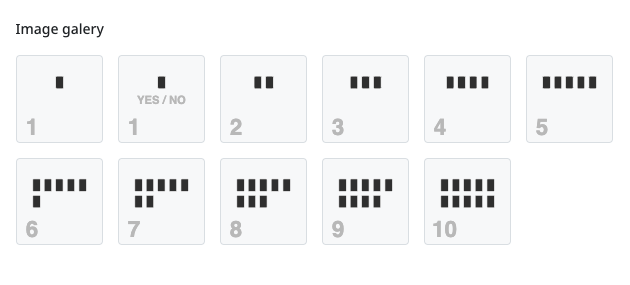

```php
'spreads' => [
        '1cards'  => ARNELIOCONNECT_DIR_URL.'img/spreads/1cards.svg',
        '0cards'  => ARNELIOCONNECT_DIR_URL.'img/spreads/0cards.svg',
        '2cards'  => ARNELIOCONNECT_DIR_URL.'img/spreads/2cards.svg',
        '3cards'  => ARNELIOCONNECT_DIR_URL.'img/spreads/3cards.svg',
        '4cards'  => ARNELIOCONNECT_DIR_URL.'img/spreads/4cards.svg',
        '5cards'  => ARNELIOCONNECT_DIR_URL.'img/spreads/5cards.svg',
        '6cards'  => ARNELIOCONNECT_DIR_URL.'img/spreads/6cards.svg',
        '7cards'  => ARNELIOCONNECT_DIR_URL.'img/spreads/7cards.svg',
        '8cards'  => ARNELIOCONNECT_DIR_URL.'img/spreads/8cards.svg',
        '9cards'  => ARNELIOCONNECT_DIR_URL.'img/spreads/9cards.svg',
        '10cards' => ARNELIOCONNECT_DIR_URL.'img/spreads/10cards.svg'
    ],
```

```php
<?php
    // Image galery
$arg = [
    'title'      => __('Image galery', 'arnelioconnect'),
    'name_option' => $name_option,
    'name'       => '',
    'initial'    => $initial,
    'values'     => $values,
    'docu'       => null,
    'info'       => __('This is the description of the user information field.','arnelioconnect'),
    'css'        => ' mb-3',
    'blo'        => null,
];
scfs_arnelioconnect_image_radio_field( $arg )
?>
```


---


### Upload zip
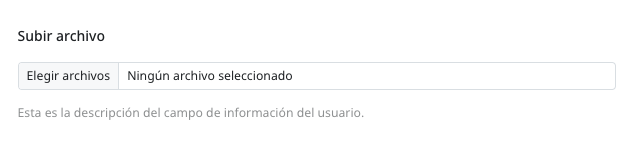

```php
<?php
    // Upload zip
$arg = [
    'title'      => __('Upload zip', 'arnelioconnect'),
    'name_option' => $name_option,
    'name'       => '',
    'initial'    => $initial,
    'values'     => $values,
    'docu'       => null,
    'info'       => __('This is the description of the user information field.','arnelioconnect'),
    'css'        => ' mb-3',
    'blo'        => null,
];
scfs_arnelioconnect_upload_zip_field( $arg )
?>
```


---


### Upload zip multiple


```php
<?php
    // Upload zip
$arg = [
    'title'      => __('Upload zip multiple', 'arnelioconnect'),
    'name_option' => $name_option,
    'name'       => '',
    'initial'    => $initial,
    'values'     => $values,
    'docu'       => null,
    'info'       => __('This is the description of the user information field.','arnelioconnect'),
    'css'        => ' mb-3',
    'blo'        => null,
];
scfs_arnelioconnect_upload_zip_multi_field( $arg )
?>
```


---


### Clases CSS para el elemento layo-field

Son las clases disponibles para el field

```css
layo-field-bg
border-bottom
```
