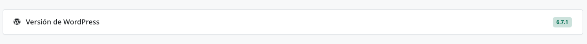

## box cabecera con badge


```html
<div class="layo-1box-arnelio mb-4">
    <div class="row gy-4">
        <div class="col layo-arnelio_section">
            <div style="width:100%" class="card text-bg-default border rounded h-100">

                <div class="layo-arnelio_section__header px-4 py-3 d-flex align-items-center justify-content-between w-100 rounded">
                    <h3><i class="bi bi-pin"></i> <?php echo __('Hola mundo', 'arnelioconnect')?></h3>
                    <div class="badge-light">6.7.1</div>
                </div>

            </div>
        </div>
    </div>
</div>
```

---


